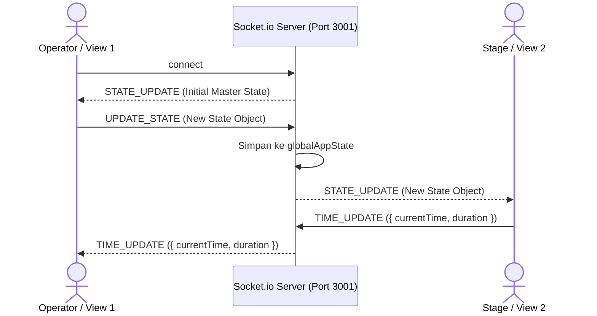

# Spesifikasi API & Protokol Socket: J-Stage Karaoke

Dokumen ini mendokumentasikan spesifikasi antarmuka pemrograman aplikasi (REST API), katalog event real-time Socket.io, serta skema struktur data state aplikasi (`AppState`) pada **J-Stage Karaoke**.

---

## 1. REST API Endpoints (`server/server.js`)

Server backend Express berjalan secara default pada port `3001` dengan dukungan CORS penuh (`cors origin: '*'`).

### 1.1 `GET /api/presets`
Mengambil daftar preset lagu karaoke yang tersimpan permanen di hard drive server.
- **Request**: Tidak membutuhkan parameter.
- **Response**:
  ```json
  {
    "presets": [
      {
        "id": "sample-radwimps-zenzenzense",
        "title": "Zenzenzense (前前前世)",
        "artist": "RADWIMPS",
        "animeTitle": "Kimi no Na wa (Your Name)",
        "source": "youtube",
        "youtubeId": "PDSkFeMVNFs",
        "duration": 285,
        "rawLyrics": "[00:15.50] やっと目を覚ましたかい..."
      }
    ]
  }
  ```

### 1.2 `POST /api/presets`
Menyimpan atau menimpa seluruh daftar preset lagu ke disk server (`server/data/presets.json`).
- **Request Header**: `Content-Type: application/json`
- **Request Body**:
  ```json
  {
    "presets": [ /* array of Song objects */ ]
  }
  ```
- **Response**:
  ```json
  {
    "success": true,
    "count": 5
  }
  ```

### 1.3 `POST /api/upload`
Mengunggah file media audio atau video (MP3, MP4, WebM, WAV) langsung ke server secara asinkron.
- **Request Header**:
  - `Content-Type: */*` (Binary Stream / Raw Body hingga 500MB)
  - `x-filename`: Nama file asli (di-encode dengan `encodeURIComponent`, contoh: `Silhouette.mp4`)
- **Mekanisme Penyimpanan**:
  - Nama file disimpan dengan prefix timestamp: `${Date.now()}-${sanitizedBaseName}${ext}` di dalam folder `server/media/`.
  - Penulisan menggunakan `fs.promises.writeFile` non-blocking sehingga tidak memutus streaming lagu yang sedang diputar.
- **Response**:
  ```json
  {
    "success": true,
    "url": "http://192.168.1.10:3001/media/1788280652169-Silhouette.mp4",
    "fileName": "Silhouette.mp4"
  }
  ```

### 1.4 `GET /api/youtube/search`
Mencari video musik YouTube menggunakan modul `yt-search` tanpa kuota Google Cloud API.
- **Query Parameter**: `q` (string, wajib)
- **Contoh Request**: `/api/youtube/search?q=Gurenge+LiSA+Karaoke`
- **Response**:
  ```json
  {
    "videos": [
      {
        "videoId": "CwkzK-Fh408",
        "title": "LiSA - Gurenge (Official Karaoke Video)",
        "artist": "LiSA Official",
        "duration": 240,
        "durationFormatted": "04:00",
        "thumbnail": "https://i.ytimg.com/vi/CwkzK-Fh408/hqdefault.jpg",
        "url": "https://youtube.com/watch?v=CwkzK-Fh408"
      }
    ]
  }
  ```

### 1.5 Static Media Serving: `/media`
- **Path**: `server/media/`
- **Fitur Khusus**: Mendukung header HTTP `Accept-Ranges: bytes` dan status HTTP `206 Partial Content`.
- **Manfaat**: Pemutar HTML5 dapat melakukan seeking waktu ke detik mana pun secara instan tanpa mengunduh keseluruhan file.

---

## 2. Protokol WebSocket Socket.io

WebSocket digunakan untuk sinkronisasi multi-layar antar perangkat yang terhubung dalam satu jaringan Wi-Fi/LAN.



### Daftar Event Socket.io:

| Nama Event | Tipe Alur | Payload | Deskripsi |
|---|---|---|---|
| `connection` | Server-Side | `socket` | Klien baru terhubung; server langsung mengirimkan `STATE_UPDATE` dengan state terkini. |
| `UPDATE_STATE` | Klien -> Server | `AppState` | Dikirim oleh klien saat terjadi perubahan state (ganti antrean, tombol ditekan, dsb). |
| `STATE_UPDATE` | Server -> Klien | `AppState` | Disiarkan (`socket.broadcast`) oleh server ke seluruh klien lain yang sedang aktif. |
| `TIME_UPDATE` | Dua Arah | `{ currentTime: number, duration?: number }` | Mengalirkan posisi waktu pemutaran audio/video dari layar aktif ke layar lainnya. |
| `disconnect` | Server-Side | - | Klien terputus dari server. |

---

## 3. Skema Data Master (`src/types/karaoke.ts`)

### 3.1 Skema `AppState`
```typescript
export interface AppState {
  currentQueueItem: QueueItem | null;       // Lagu & penyanyi yang sedang tampil
  queue: QueueItem[];                       // Daftar antrean tunggu lagu berikutnya
  history: ParticipantScore[];              // Riwayat peserta yang telah selesai tampil
  isPlaying: boolean;                       // Status pemutaran media
  currentTime: number;                      // Posisi detik pemutaran saat ini
  duration: number;                         // Total durasi lagu aktif dalam detik
  volume: number;                           // Volume audio global (0 - 100)
  isMuted: boolean;                         // Status mute audio
  vocalGuide: boolean;                      // true = Vokal ON, false = Instrumental / Minus-One
  activeMode: EventMode;                    // 'train' atau 'competition'
  scoringConfig: ScoringConfig;             // Bobot persentase & kriteria penjurian
  livePitch: LivePitchData;                 // Data analisis frekuensi vokal mikrofon real-time
  judges: JudgeInfo[];                      // Daftar panel dewan juri
  submissions: JudgeSubmission[];           // Nilai juri untuk lagu yang sedang aktif
  showLeaderboard: boolean;                 // Flag penampil overlay leaderboard panggung
  showScoreOverlay: boolean;                // Flag penampil ringkasan skor peserta
  activeSingerScoreSummary?: ParticipantScore | null;
  soundFxTrigger?: { id: string; name: string; timestamp: number } | null;
  playerCommand?: PlayerCommand | null;     // Perintah seek / replay / stop instan
}
```

### 3.2 Skema `Song`
```typescript
export interface Song {
  id: string;
  title: string;
  artist: string;
  source: 'youtube' | 'local';
  youtubeId?: string;
  mediaUrl?: string;            // URL audio/video lokal utama (Vocal / Main Version)
  isVideo?: boolean;            // true jika mediaUrl berupa video MP4/WebM
  instrumentalUrl?: string;     // URL track instrumental studio terpisah (opsional)
  instrumentalFileName?: string;
  duration: number;
  rawLyrics?: string;           // String teks mentah format LRC
  parsedLyrics?: LyricLine[];   // Array baris lirik yang telah diparsing
  coverArt?: string;            // Gambar cover (Base64 atau HTTP URL)
  animeTitle?: string;          // Judul anime terkait (misal: "Your Name", "Demon Slayer")
}
```

### 3.3 Skema `QueueItem`
```typescript
export interface QueueItem {
  id: string;
  song: Song;
  singerName: string;
  performerNote?: string;
  mode: EventMode;              // 'train' | 'competition'
  addedAt: number;
  status: 'waiting' | 'playing' | 'completed';
}
```

### 3.4 Skema `JudgeSubmission` & `ParticipantScore`
```typescript
export interface JudgeSubmission {
  judgeId: string;
  judgeName: string;
  queueItemId: string;
  criteriaScores: Record<string, number>; // criterionId -> score (0-100)
  totalJudgeScore: number;
  comments?: string;
  submittedAt: number;
}

export interface ParticipantScore {
  id: string;
  queueItemId: string;
  singerName: string;
  songTitle: string;
  artist: string;
  pitchScore: number;
  judgeScore: number;
  finalScore: number;
  breakdown: {
    pitchScore: number;
    judgeAverage: number;
    judgeSubmissionsCount: number;
  };
  completedAt: number;
}
```
