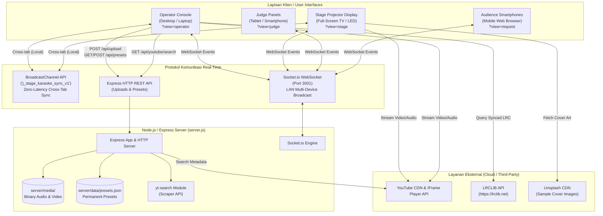
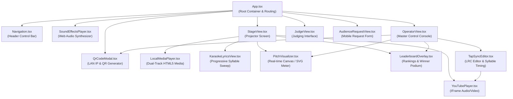
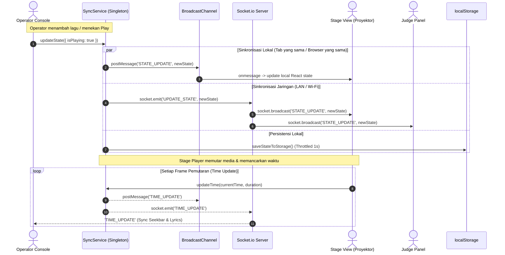
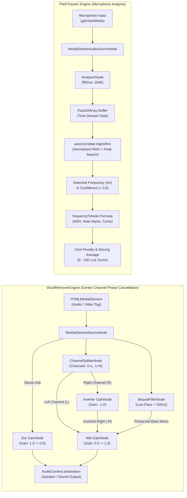
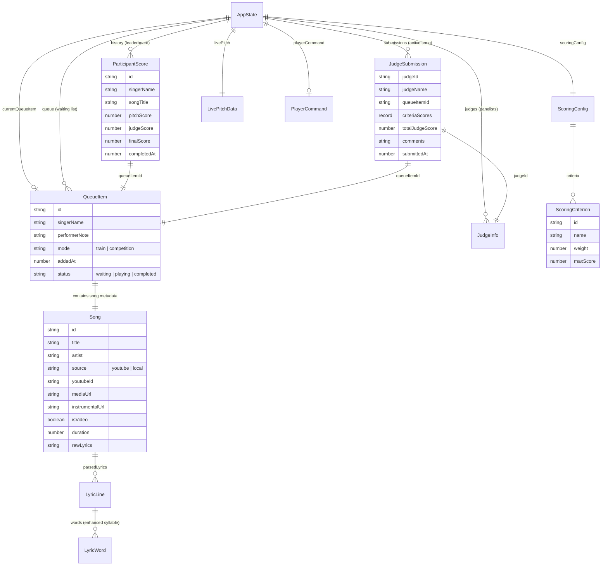

# Knowledge Graph: J-Stage Karaoke

Dokumen ini memetakan seluruh arsitektur, modul, dependensi, alur data, dan relasi entitas sistem **J-Stage Karaoke** dalam bentuk **Knowledge Graph** berbasis diagram Mermaid. 

---

## 1. Topologi Jaringan & Sistem (System & Network Topology)

Diagram ini mengilustrasikan interaksi fisik dan protokol antar piranti pengguna (Operator, Layar Panggung, Juri, Penonton) dengan Backend Sync Server dan Layanan Eksternal.

---

## 2. Hierarki Komponen UI & Visual Layout (Component Knowledge Graph)

Diagram ini memetakan dekomposisi antarmuka React dari root `App.tsx` ke setiap view spesifik, komponen pemutar, dan overlay interaktif.

---

## 3. Alur Data & Siklus Sinkronisasi State (Data Flow & State Lifecycle)

Diagram ini memvisualisasikan bagaimana perubahan state dieksekusi, disiarkan, dan disinkronkan ke seluruh klien.

---

## 4. Pipeline Audio DSP & Deteksi Pitch (Audio Engineering Pipeline)

Diagram ini merinci dua alur pemrosesan audio berbasis **Web Audio API**:
1. **Vocal Cancellation Engine** (Pemisahan vokal kanal tengah).
2. **Pitch Tracker Engine** (Analisis frekuensi mikrofon untuk kompetisi).

---

## 5. Model Data & Relasi Entitas (Entity-Relationship Graph)

Diagram ini mengilustrasikan struktur tipe data TypeScript dan bagaimana entitas saling berhubungan di dalam `AppState`.

---

## 6. Peta Relasi Modul Kode (Codebase Module Map)

Matriks ketergantungan antar modul dalam direktori proyek:

| Modul Sumber (`src/`) | Modul Dependensi Utama | Peran Arsitektural |
|---|---|---|
| `App.tsx` | `SyncService`, `Navigation`, Views, `SoundEffectsPlayer`, `QrCodeModal` | Root Orchestrator & View Switcher |
| `StageView.tsx` | `SyncService`, `YouTubePlayer`, `LocalMediaPlayer`, `KaraokeLyricsView`, `PitchVisualizer`, `LeaderboardOverlay` | Tampilan Layar Utama / Panggung |
| `OperatorView.tsx` | `SyncService`, `PresetService`, `PitchTracker`, `TapSyncEditor`, `lrclibService`, `metadataExtractor` | Pusat Kendali & Pengelolaan Media |
| `JudgeView.tsx` | `SyncService`, `AppState` | Panel Penjurian Kontes |
| `AudienceRequestView.tsx` | `SyncService`, `PresetService` | Portal Request Penonton |
| `TapSyncEditor.tsx` | `YouTubePlayer`, `lyricParser` | Studio Editing Timing Lirik |
| `LocalMediaPlayer.tsx` | `VocalRemoverEngine`, `types/karaoke` | Player Media Lokal Dual-Track |
| `SyncService.ts` | `socket.io-client`, `lyricParser`, `types/karaoke` | Master State Manager & Network Sync |
| `server/server.js` | `express`, `socket.io`, `yt-search`, Node `fs/path` | WebSocket Relay & Media Storage Server |

---

## 7. Cara Memperbarui Knowledge Graph Ini

Ketika kode mengalami perubahan atau penambahan fitur baru, perbarui file ini mengikuti aturan berikut:
1. **Komponen Baru**: Tambahkan node pada *Section 2 (Component Knowledge Graph)* di bawah view atau direktori yang sesuai.
2. **Field State Baru**: Perbarui *Section 5 (Entity-Relationship Graph)* jika ada entitas baru di `src/types/karaoke.ts`.
3. **Endpoint Server / WebSocket Event**: Perbarui *Section 1 (System & Network Topology)* dan `docs/api-and-socket.md`.
4. **Alur Audio / DSP Baru**: Perbarui *Section 4 (Audio Engineering Pipeline)* jika menambahkan efek vokal (reverb, equalizer, dsb).
